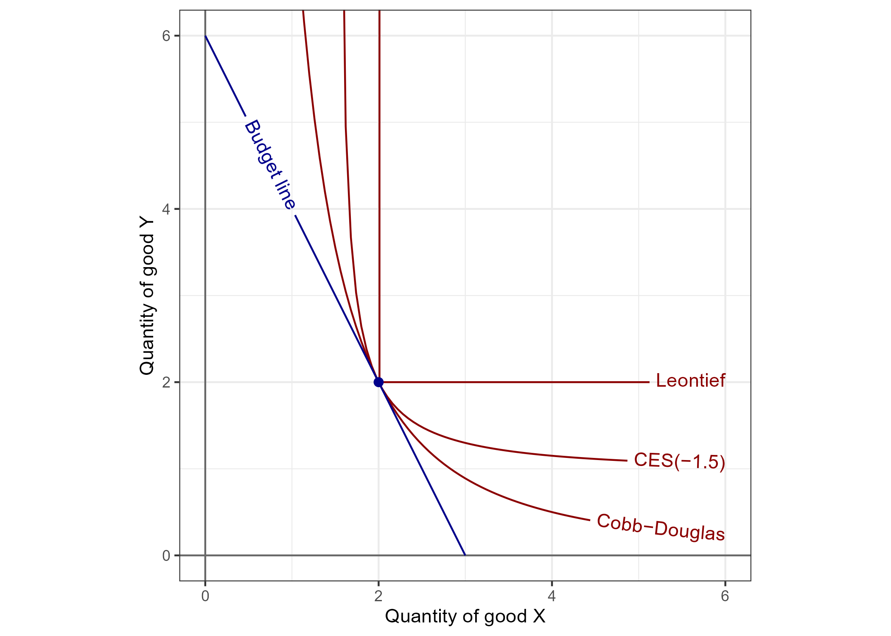
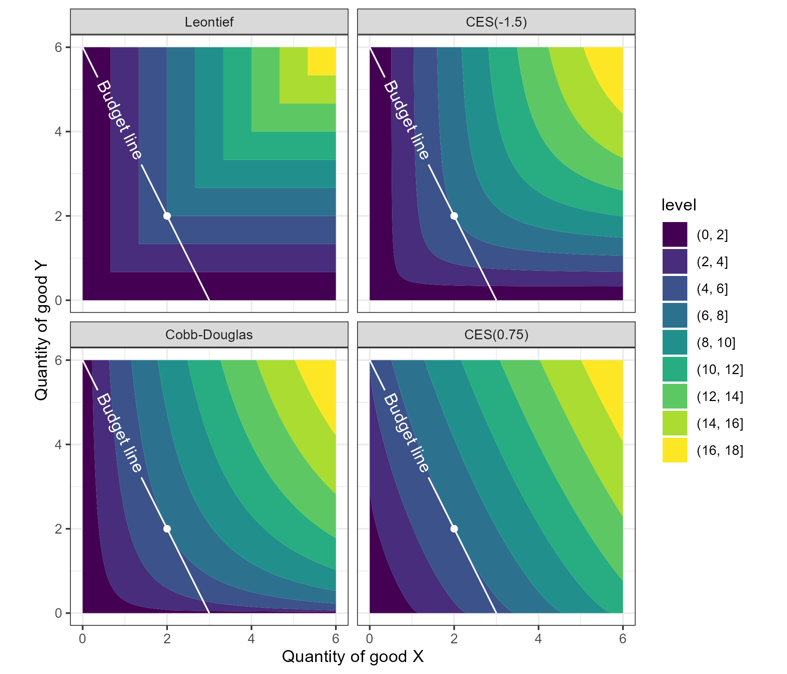
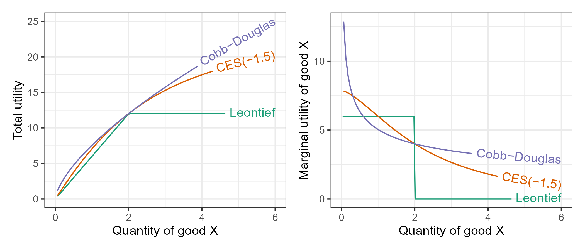
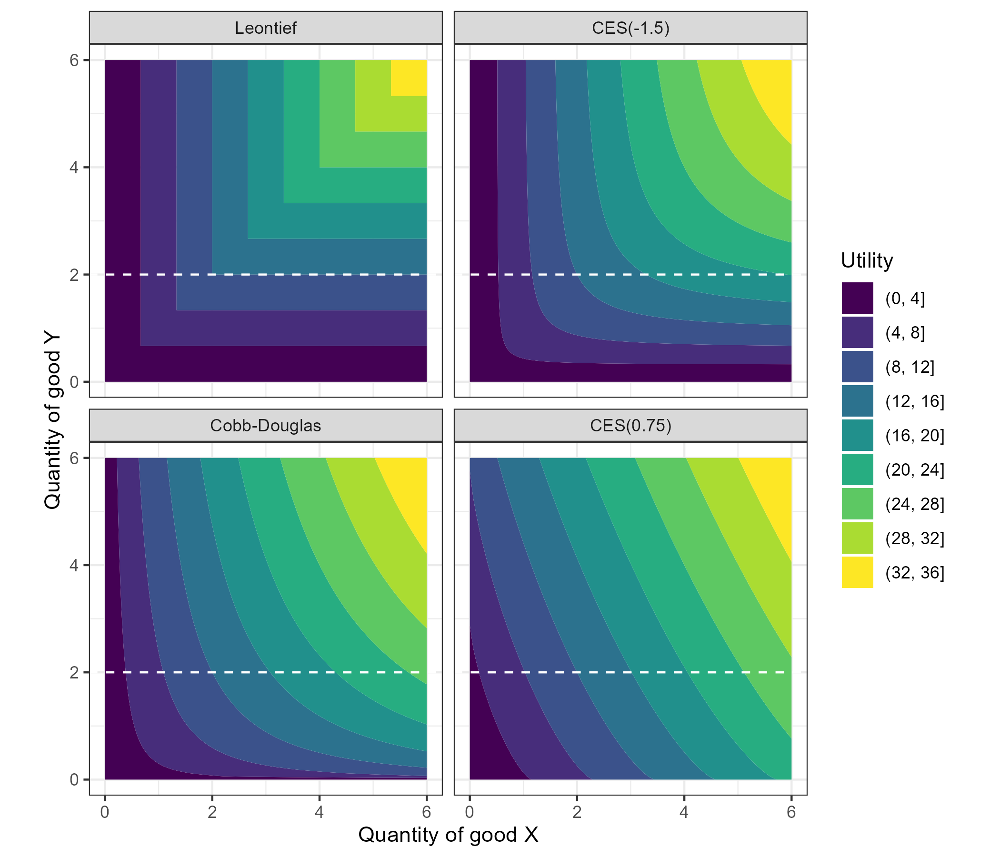
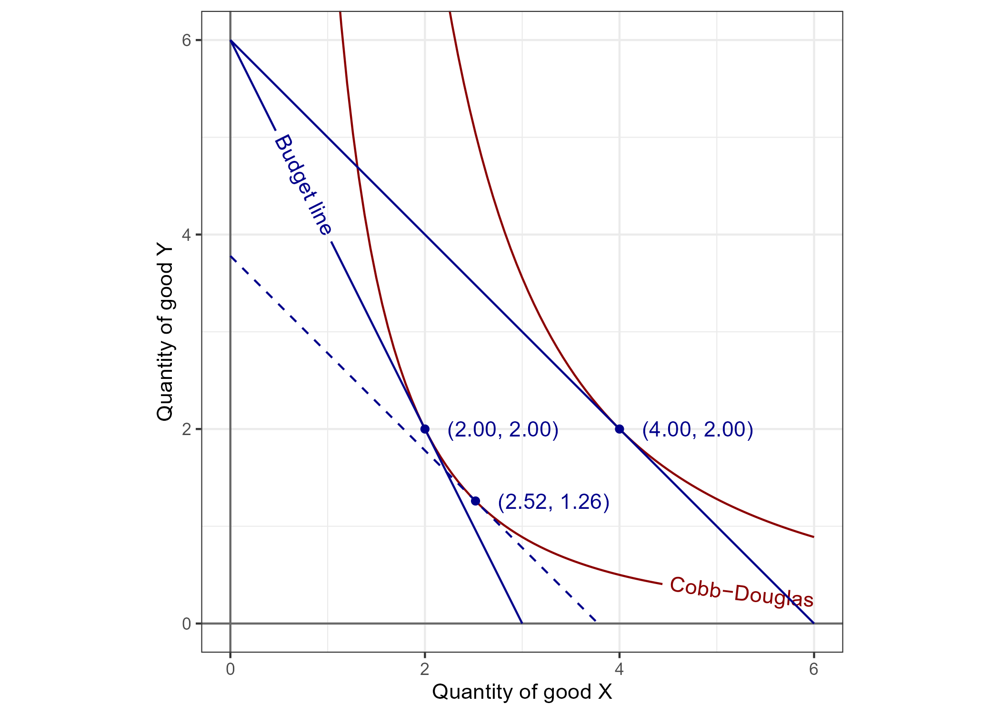

<!-- README.md is generated from README.qmd. Please edit that file -->

# econagent

<!-- badges: start -->

[](https://lifecycle.r-lib.org/articles/stages.html#experimental)
<!-- badges: end -->

econagent provides utility functions and composite goods in economics.

## Installation

You can install the development version of econagent from
[GitHub](https://github.com/) with:

``` r
# install.packages("devtools")
devtools::install_github("UchidaMizuki/econagent")
```

## Examples for utility functions

``` r
library(econagent)
library(tidyverse)
```

### Calibrate utility functions

- Utility functions:
  - `util_cobb_douglas()`: Cobb-Douglas utility function
  - `util_leontief()`: Leontief utility function
  - `util_ces()`: Constant elasticity of substitution (CES) utility
    function
  - `util_cet()`: Constant elasticity of transformation (CET) utility
    function
- `util_calibrate()`: Fit parameters of utility functions to the given
  prices and quantities.

``` r
# Sample data
prices <- c(4, 2)
income <- 12

quantity_x <- 2
quantity_y <- util_2goods_budget(prices, income)(quantity_x)
quantities <- c(quantity_x, quantity_y)
```

``` r
cobb_douglas <- util_cobb_douglas() |>
  util_calibrate(prices, quantities)
cobb_douglas
#> <Cobb-Douglas>
#> function(quantities, efficiency, weights) {
#>     efficiency * prod(quantities^weights, na.rm = TRUE)
#>   }
#> <bytecode: 0x0000016d65cae040>
#> <environment: 0x0000016d65c63970>
#> (
#>   efficiency = 6
#>   weights =    [1] 0.6666667 0.3333333
#>   ...
#> )
leontief <- util_leontief() |>
  util_calibrate(prices, quantities)
leontief
#> <Leontief>
#> function(quantities, efficiency, weights) {
#>     efficiency * min(quantities / weights, na.rm = TRUE)
#>   }
#> <bytecode: 0x0000016d65413b98>
#> <environment: 0x0000016d654285f0>
#> (
#>   efficiency = 3
#>   weights =    [1] 0.5 0.5
#>   ...
#> )
ces_minus_1_5 <- util_ces(substitution = -1.5) |>
  util_calibrate(prices, quantities)
ces_minus_1_5
#> <CES(-1.5)>
#> function(quantities, substitution, homogeneity, efficiency, weights) {
#>     efficiency *
#>       sum(weights * quantities^substitution, na.rm = TRUE)^(homogeneity /
#>         substitution)
#>   }
#> <bytecode: 0x0000016d6507c658>
#> <environment: 0x0000016d65075900>
#> (
#>   substitution = -1.5
#>   homogeneity =  1
#>   efficiency =   6
#>   weights =      [1] 0.6666667 0.3333333
#>   ...
#> )
```

### Indifference curve and budget line for two goods

- `util_2goods_indifference()` returns the function of indifference
  curve.
- `util_2goods_budget()` returns the function of budget line.

``` r
util_2goods_indifference(cobb_douglas, cobb_douglas(quantities))(1:6)
#> [1] 8.0000000 2.0000000 0.8888889 0.5000000 0.3200000 0.2222222
util_2goods_budget(prices, income)(1:6)
#> [1]  4  2  0 -2 -4 -6
```

#### Sample plots

    #> Warning: package 'geomtextpath' was built under R version 4.6.1





### Marginal utility for two goods

- `util_2goods_utility()` returns the function of total utility or
  marginal utility with a given quantity of good Y.
  - `gradient = FALSE`: Total utility (default)
  - `gradient = TRUE`: Marginal utility for good X

``` r
# Total utility
util_2goods_utility(cobb_douglas, quantities[[2]])(1:6)
#> [1]  7.559526 12.000000 15.724448 19.048813 22.104189 24.961006
# Marginal utility
util_2goods_utility(cobb_douglas, quantities[[2]], gradient = TRUE)(1:6)
#> [1] 5.039684 4.000000 3.494322 3.174802 2.947225 2.773445
```

#### Sample plots





### Price effect for two goods

``` r
prices_new <- c(2, 2)

# Price effect
quantities_new <- util_demand(cobb_douglas, prices_new, income = income)
quantities_new
#> [1] 4 2
# Substitution effect
quantities_substitution <- util_demand(
  cobb_douglas,
  prices_new,
  utility = cobb_douglas(quantities)
)
quantities_substitution
#> [1] 2.519842 1.259921
# Income effect
quantities_new - quantities_substitution
#> [1] 1.480158 0.740079
```

#### Sample plots



## Examples for composite goods

A composite good aggregates several elementary (or already-composite)
goods into one new good through a utility/production function, giving it
its own derived price (a price index) and quantity. Composite goods can
themselves feed into a further composite, forming a tree — e.g. an
input-output-table style nested production structure.

- `goods_by()`: Build a tree of goods from a data frame, grouped by the
  given variables.
- `goods_compose()`: Aggregate a group of goods into one composite good
  using a utility function (e.g. `util_cobb_douglas()`,
  `util_leontief()`, `util_ces()`).
- `goods_produce()`: Given a target quantity at some node, derive the
  implied quantities of its input goods down the tree.
- `goods_consume()`: Given income at some node, derive the quantities
  consumed at each level of the tree.
- `goods_reprice()`: Propagate a price change at the leaves up the tree,
  recomputing composite price indices.
- `goods_trade_iceberg()` / `goods_trade_update()`: Apply (or update) an
  iceberg trade cost as another kind of composite-good transformation.

As an example, consider two industries — manufacturing and services —
each producing gross output from value added (labor and capital,
combined with a Cobb-Douglas function) and intermediate input bought
from the other industry (combined with a Leontief function, i.e. fixed
proportions):

``` r
labor_capital <- tibble::tibble(
  output_sector = rep(c("manufacturing", "services"), each = 2),
  input_sector = rep(c("labor", "capital"), times = 2),
  quantity = c(60, 40, 30, 20)
)
value_added <- labor_capital |>
  goods_by(output_sector, input_sector) |>
  goods_compose(util_cobb_douglas(), node = factor("value_added"))

intermediate_input <- tibble::tibble(
  output_sector = c("manufacturing", "services"),
  input_sector = c("services", "manufacturing"),
  quantity = c(15, 10)
) |>
  goods_by(output_sector, input_sector)

industry <- rbind(intermediate_input, value_added) |>
  goods_compose(util_leontief())
industry
#> # Goods: 10 nodes and 3 features
#> # Trees: 
#> #   output_sector [2]
#> #   ├─input_sector [2]
#> #   └─value_added [2]
#> #     └─input_sector [4]
#>   .                             price quantity utility   
#>   <node>                        <dbl>    <dbl> <list>    
#> 1 <output_sector> manufacturing     1      115 <Leontief>
#> 2 <output_sector> services          1       60 <Leontief>
```

`timbr::climb()` flattens the tree so every level can be inspected at
once:

``` r
industry |>
  timbr::climb(output_sector, input_sector) |>
  tibble::as_tibble()
#> # A tibble: 6 × 5
#> # Groups:   output_sector [2]
#>   output_sector input_sector  price quantity utility
#>   <chr>         <chr>         <dbl>    <dbl> <list> 
#> 1 manufacturing services          1       15 <NULL> 
#> 2 services      manufacturing     1       10 <NULL> 
#> 3 manufacturing labor             1       60 <NULL> 
#> 4 manufacturing capital           1       40 <NULL> 
#> 5 services      labor             1       30 <NULL> 
#> 6 services      capital           1       20 <NULL>
```

`goods_produce()` derives the input quantities implied by a target
output quantity, working down the tree:

``` r
quantities_new <- tibble::tibble(
  output_sector = c("manufacturing", "services"),
  quantity = c(150, 90)
)
industry |>
  goods_produce(quantities_new) |>
  timbr::climb(output_sector, input_sector) |>
  tibble::as_tibble()
#> # A tibble: 6 × 5
#> # Groups:   output_sector [2]
#>   output_sector input_sector  price quantity utility
#>   <chr>         <chr>         <dbl>    <dbl> <list> 
#> 1 manufacturing services          1     19.6 <NULL> 
#> 2 services      manufacturing     1     15   <NULL> 
#> 3 manufacturing labor             1     78.3 <NULL> 
#> 4 manufacturing capital           1     52.2 <NULL> 
#> 5 services      labor             1     45   <NULL> 
#> 6 services      capital           1     30   <NULL>
```

`goods_consume()` derives the quantities consumed at each level implied
by a given income:

``` r
incomes <- tibble::tibble(
  output_sector = c("manufacturing", "services"),
  income = c(200, 100)
)
industry |>
  goods_consume(incomes) |>
  timbr::climb(output_sector, input_sector) |>
  tibble::as_tibble()
#> # A tibble: 6 × 5
#> # Groups:   output_sector [2]
#>   output_sector input_sector  price quantity utility
#>   <chr>         <chr>         <dbl>    <dbl> <list> 
#> 1 manufacturing services          1     26.1 <NULL> 
#> 2 services      manufacturing     1     16.7 <NULL> 
#> 3 manufacturing labor             1    104.  <NULL> 
#> 4 manufacturing capital           1     69.6 <NULL> 
#> 5 services      labor             1     50   <NULL> 
#> 6 services      capital           1     33.3 <NULL>
```

`goods_reprice()` propagates a leaf price change up the tree: raising
the price of labor in manufacturing raises the composite price of
manufacturing’s gross output, while leaving services (which doesn’t use
manufacturing’s labor) unaffected:

``` r
prices_new <- tibble::tibble(
  output_sector = "manufacturing",
  input_sector = "labor",
  price = 1.5
)
industry |>
  goods_reprice(prices_new)
#> # Goods: 10 nodes and 3 features
#> # Trees: 
#> #   output_sector [2]
#> #   ├─input_sector [2]
#> #   └─value_added [2]
#> #     └─input_sector [4]
#>   .                             price quantity utility   
#>   <node>                        <dbl>    <dbl> <list>    
#> 1 <output_sector> manufacturing  1.24      115 <Leontief>
#> 2 <output_sector> services       1          60 <Leontief>
```
