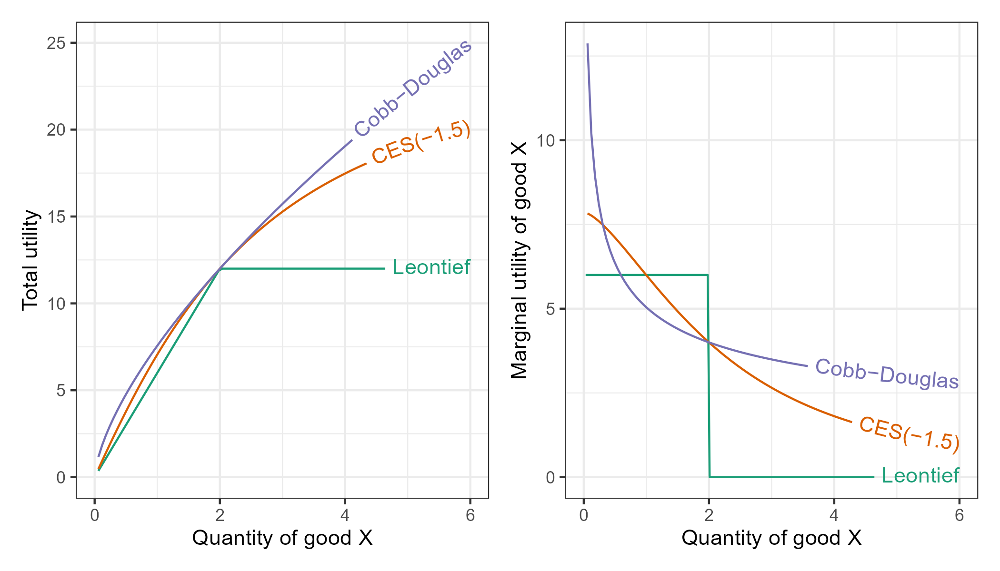

<!-- README.md is generated from README.Rmd. Please edit that file -->

# econgoods

<!-- badges: start -->

[](https://lifecycle.r-lib.org/articles/stages.html#experimental)
<!-- badges: end -->

econgoods provides utility functions and composite goods in economics.

## Installation

You can install the development version of econgoods from
[GitHub](https://github.com/) with:

``` r
# install.packages("devtools")
devtools::install_github("UchidaMizuki/econgoods")
```

## Examples for utility functions

``` r
library(econgoods)
library(tidyverse)
```

### Calibrate utility functions

- Utility functions:
  - `util_cobb_douglas()`: Cobb-Douglas utility function
  - `util_leontief()`: Leontief utility function
  - `util_ces()`: Constant elasticity of substitution (CES) utility
    function
- `util_calibrate()`: Fit parameters of utility functions to the given
  prices and quantities.

``` r
# Sample data
prices <- c(4, 2)
income <- 12

quantity_x <- 2
quantity_y <- util_2goods_budget(prices, income)(quantity_x)
quantities <- c(quantity_x, quantity_y)
```

``` r
cobb_douglas <- util_cobb_douglas() |> 
  util_calibrate(prices, quantities)
cobb_douglas
#> <Cobb-Douglas>
#> function (quantities, efficiency, weights) 
#> {
#>     efficiency * prod(quantities^weights, na.rm = TRUE)
#> }
#> (
#>   efficiency = 6
#>   weights    = [1] 0.6666667 0.3333333
#>   ...
#> )
```

``` r
leontief <- util_leontief() |> 
  util_calibrate(prices, quantities)
leontief
#> <Leontief>
#> function (quantities, efficiency, weights) 
#> {
#>     efficiency * min(quantities/weights, na.rm = TRUE)
#> }
#> (
#>   efficiency = 3
#>   weights    = [1] 0.5 0.5
#>   ...
#> )
```

``` r
ces_minus_1_5 <- util_ces(substitution = -1.5) |> 
  util_calibrate(prices, quantities)
ces_minus_1_5
#> <CES(-1.5)>
#> function (quantities, substitution, homogeneity, efficiency, 
#>     weights) 
#> {
#>     efficiency * sum(weights * quantities^substitution, na.rm = TRUE)^(homogeneity/substitution)
#> }
#> (
#>   substitution = -1.5
#>   homogeneity  = 1
#>   efficiency   = 6
#>   weights      = [1] 0.6666667 0.3333333
#>   ...
#> )
```

### Indifference curve and budget line for two goods

- `util_2goods_indifference()` returns the function of indifference
  curve.
- `util_2goods_budget()` returns the function of budget line.

``` r
util_2goods_indifference(cobb_douglas, quantities)(1:6)
#> [1] 8.0000000 2.0000000 0.8888889 0.5000000 0.3200000 0.2222222
```

``` r
util_2goods_budget(prices, income)(1:6)
#> [1]  4  2  0 -2 -4 -6
```

#### Sample plots


### Marginal utility for two goods

- `util_2goods_utility()` returns the function of total utility or
  marginal utility
  - `gradient = FALSE`: Total utility (default)
  - `gradient = TRUE`: Marginal utility

``` r
# Total utility
util_2goods_utility(cobb_douglas, quantities[[2]])(1:6)
#> [1]  7.559526 12.000000 15.724448 19.048813 22.104189 24.961006
```

``` r
# Marginal utility
util_2goods_utility(cobb_douglas, quantities[[2]], gradient = TRUE)(1:6)
#> [1] 5.039684 4.000000 3.494322 3.174802 2.947225 2.773445
```

#### Sample plots



### Price effect for two goods

``` r
prices_new <- c(2, 2)

# Price effect
quantities_new <- util_demand(cobb_douglas, prices_new,
                              income = income)
quantities_new
#> [1] 4 2
```

``` r
# Substitution effect
quantities_substitution <- util_demand(cobb_douglas, prices_new,
                                       utility = cobb_douglas(quantities))
quantities_substitution
#> [1] 2.519842 1.259921
```

``` r
# Income effect
quantities_new - quantities_substitution
#> [1] 1.480158 0.740079
```

#### Sample plots


## Examples for composite goods

- TODO
